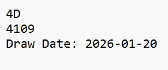
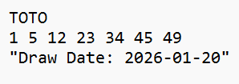
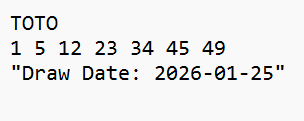

# Lottery Ticket Checker (TOTO & 4D)

## Overview
This project is a web-based lottery ticket checker that allows users to upload images of Singapore Pools TOTO or 4D tickets. The system uses Optical Character Recognition (OCR) to extract ticket information, validates the ticket format, checks prize results, and displays outcomes in a user-friendly, multi-language interface designed to be accessible for elderly users.

---

## Features

### Core Features
- Image upload for TOTO and 4D tickets
- OCR-based number extraction
- Automatic game type classification
- Prize checking logic
- Ticket history storage using SQLite
- Multi-language user interface:
  - English
  - Simplified Chinese
  - Bahasa Melayu
  - Tamil

### Supported Games
- **TOTO**
  - Standard ticket validation
  - Combination-based prize checking
- **4D**
  - First, Second, Third prizes
  - Starter and Consolation prizes

---

## Screenshots

Screenshots of mock 4D/TOTO tickets were used to test the OCR extraction and number validation. 

### Sample 4D Tickets



### Sample TOTO Tickets






---
## System Architecture

### Backend
- Python FastAPI
- Tesseract OCR
- SQLite database
- Modular service-oriented design:
  - OCR service
  - Ticket model
  - Prize checker
  - Winning number service
  - Database layer

### Frontend
- HTML, CSS, JavaScript
- Fetch API for backend communication
- Dynamic language switching
- Large fonts and high contrast for accessibility

---

## Project Structure


backend/
├── main.py
├── models/
│ └── ticket.py
├── services/
│ ├── ocr_service.py
│ ├── result_checker.py
│ └── winning_number_service.py
├── db/
│ └── database.py
├── uploads/

frontend/
├── index.html
├── script.js
├── styles.css


---

## Application Flow

1. User uploads a ticket image
2. OCR extracts text and numbers from the image
3. Game type (TOTO or 4D) is automatically detected
4. Extracted numbers are validated
5. Winning numbers are retrieved (hard-coded for demo)
6. Prize results are calculated
7. Ticket information is saved to the database
8. Results are displayed on the frontend

---

## Design Decisions

- Winning numbers are hard-coded for demonstration stability
- OCR validation is tolerant to real-world image noise
- Language translation is handled entirely on the frontend
- Backend focuses on correctness, modularity, and reliability

---

## Prerequisites
- Python 3.9+
- Tesseract OCR installed
- Modern web browser (Chrome / Edge / Firefox)
- fastapi
- uvicorn
- python-multipart (for fileupload)
- pillow

pip install fastapi uvicorn python-multipart pytesseract pillow

## API Endpoints

---

## How to Run

### Backend

```bash
uvicorn backend.main:app --port 8001

### Frontend
cd frontend
python -m http.server 5500
http://localhost:5500

### Limitations

- Winning numbers are not fetched live
- OCR accuracy depends on image quality

### Future Improvements

- Live winning number integration
- Admin interface for updating results
- Enhanced OCR preprocessing
- Mobile application support 

### Troubleshooting

This section documents common issues encountered during development and how they were resolved.

1. Backend Cannot Be Reached from Frontend (CORS Error)

Issue
The frontend failed to connect to the FastAPI backend, even though the backend was running successfully.

Cause
Cross-Origin Resource Sharing (CORS) restrictions blocked requests from the frontend (running on a different port).

Solution
CORS middleware was added to the FastAPI application to allow cross-origin requests during development.

from fastapi.middleware.cors import CORSMiddleware

app.add_middleware(
    CORSMiddleware,
    allow_origins=["*"],
    allow_methods=["*"],
    allow_headers=["*"],
)

2. SQLite “Database Is Locked” Error

Issue
Frequent 500 Internal Server Error responses with messages indicating the SQLite database was locked.

Cause
Multiple rapid database writes while the server was running caused SQLite to lock the database file.

Solution
The database connection was adjusted to include a timeout and allow safe concurrent access.
Additionally, the server was restarted cleanly when locks occurred.

3. OCR Extracted Incorrect or Noisy Numbers

Issue
OCR extracted extra numbers from draw dates or split valid numbers into multiple parts (e.g., 4 1 0 9 instead of 4109).

Cause
Real-world ticket images contain dates, spacing, and inconsistent formatting that OCR interprets as separate numbers.

Solution
Validation logic was designed to tolerate OCR noise by:

Filtering out year-like values

Reconstructing split digits

Selecting valid number ranges only

This significantly improved OCR robustness for both TOTO and 4D tickets.

4. Valid 4D Tickets Rejected with “Invalid 4D Ticket Format”

Issue
Valid 4D tickets were incorrectly rejected with a 400 Bad Request.

Cause
Initial validation logic assumed a clean, single 4-digit number from OCR, which is unrealistic for real images.

Solution
4D validation logic was revised to accept:

One grouped 4-digit number

Four single digits

Mixed digit groupings

Invalid or ambiguous results continue to be rejected correctly.

5. Frontend Language Switching Stopped Working

Issue
After adding multilingual support, the language switcher and “Check Ticket” button stopped responding.

Cause
A JavaScript syntax error (missing comma or brace) caused the entire script to fail loading.

Solution
The JavaScript file was reviewed and corrected.
Global state management was introduced to ensure dynamic content (such as prize labels) re-rendered correctly when the language changed.

6. Prize Labels Did Not Update When Language Changed

Issue
Prize labels (e.g., “1st Prize”, “Starter”) remained in the language used when the ticket was checked.

Cause
Dynamic prize content was rendered only once and not re-rendered on language change.

Solution
The last API response was stored in memory, and the result display was re-rendered whenever the language selection changed.

7. Internal Server Errors After Introducing External JSON Data

Issue
Introducing JSON-based winning number files caused repeated 500 Internal Server Error responses.

Cause
Data structure mismatches between JSON content and backend logic introduced type errors.

Solution
The system was reverted to hard-coded winning numbers to ensure stability and reduce complexity, which is acceptable for demonstration purposes.

8. CSS Not Applied to Frontend

Issue
The frontend UI rendered correctly but without styles applied.

Cause
The CSS file was not correctly linked or served by the frontend server.

Solution
The project structure was verified, and the CSS file was properly linked in index.html.

9. JavaScript Functions Reported as “Not Defined”

Issue
Errors such as uploadTicket is not defined or changeLanguage is not defined appeared in the browser console.

Cause
JavaScript execution stopped due to earlier syntax errors.

Solution
The script was fully validated to ensure:

All brackets and commas were correctly closed

Functions were defined before being referenced

The script loaded without console errors

Notes
Most issues encountered were related to real-world constraints such as OCR inaccuracies, browser security policies, and JavaScript runtime behavior. Resolving these issues improved the robustness, usability, and maintainability of the system.

### Acknowledgements

- FastAPI
- Tesseract OCR/pytesseract
- SQLite

### License

This project is for educational purposes